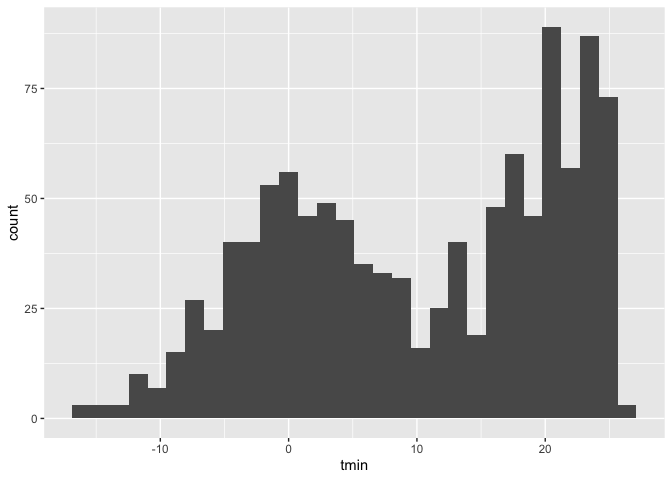

viz_i
================
2022-09-28

``` r
library(tidyverse)
```

    ## ── Attaching packages ─────────────────────────────────────── tidyverse 1.3.2 ──
    ## ✔ ggplot2 3.3.6      ✔ purrr   0.3.4 
    ## ✔ tibble  3.1.8      ✔ dplyr   1.0.10
    ## ✔ tidyr   1.2.0      ✔ stringr 1.4.1 
    ## ✔ readr   2.1.2      ✔ forcats 0.5.2 
    ## ── Conflicts ────────────────────────────────────────── tidyverse_conflicts() ──
    ## ✖ dplyr::filter() masks stats::filter()
    ## ✖ dplyr::lag()    masks stats::lag()

``` r
library(ggridges)
library(patchwork)
```

## load the weather data

``` r
weather_df = 
  rnoaa::meteo_pull_monitors(  ##access to the public online data rather than read a file
    c("USW00094728", "USC00519397", "USS0023B17S"),
    var = c("PRCP", "TMIN", "TMAX"), 
    date_min = "2017-01-01",
    date_max = "2017-12-31") %>%
  mutate(  ##reorganize the dataset
    name = recode(
      id, 
      USW00094728 = "CentralPark_NY", 
      USC00519397 = "Waikiki_HA",
      USS0023B17S = "Waterhole_WA"),
    tmin = tmin / 10,
    tmax = tmax / 10) %>%
  select(name, id, everything())
```

    ## Registered S3 method overwritten by 'hoardr':
    ##   method           from
    ##   print.cache_info httr

    ## using cached file: ~/Library/Caches/R/noaa_ghcnd/USW00094728.dly

    ## date created (size, mb): 2022-09-28 15:06:12 (8.401)

    ## file min/max dates: 1869-01-01 / 2022-09-30

    ## using cached file: ~/Library/Caches/R/noaa_ghcnd/USC00519397.dly

    ## date created (size, mb): 2022-09-28 15:06:15 (1.699)

    ## file min/max dates: 1965-01-01 / 2020-03-31

    ## using cached file: ~/Library/Caches/R/noaa_ghcnd/USS0023B17S.dly

    ## date created (size, mb): 2022-09-28 15:06:17 (0.95)

    ## file min/max dates: 1999-09-01 / 2022-09-30

``` r
weather_df
```

    ## # A tibble: 1,095 × 6
    ##    name           id          date        prcp  tmax  tmin
    ##    <chr>          <chr>       <date>     <dbl> <dbl> <dbl>
    ##  1 CentralPark_NY USW00094728 2017-01-01     0   8.9   4.4
    ##  2 CentralPark_NY USW00094728 2017-01-02    53   5     2.8
    ##  3 CentralPark_NY USW00094728 2017-01-03   147   6.1   3.9
    ##  4 CentralPark_NY USW00094728 2017-01-04     0  11.1   1.1
    ##  5 CentralPark_NY USW00094728 2017-01-05     0   1.1  -2.7
    ##  6 CentralPark_NY USW00094728 2017-01-06    13   0.6  -3.8
    ##  7 CentralPark_NY USW00094728 2017-01-07    81  -3.2  -6.6
    ##  8 CentralPark_NY USW00094728 2017-01-08     0  -3.8  -8.8
    ##  9 CentralPark_NY USW00094728 2017-01-09     0  -4.9  -9.9
    ## 10 CentralPark_NY USW00094728 2017-01-10     0   7.8  -6  
    ## # … with 1,085 more rows

## Scatterplots

Create my first scatterplot ever

``` r
ggplot(weather_df, aes(x = tmin, y = tmax)) + 
  geom_point()
```

    ## Warning: Removed 15 rows containing missing values (geom_point).

<!-- -->

new approach, same plot:

``` r
weather_df %>%
  ggplot(aes(x = tmin, y = tmax)) +
  geom_point()
```

    ## Warning: Removed 15 rows containing missing values (geom_point).

<!-- --> save and edit
a plot object

``` r
weather_plot =
  weather_df %>%
  ggplot(aes(x = tmin,y = tmax))

weather_plot + geom_point()
```

    ## Warning: Removed 15 rows containing missing values (geom_point).

<!-- -->

## Advancedd scatterplot

start with the same one and make it fancy!

``` r
weather_df %>%
  ggplot(aes(x = tmin,y = tmax, color = name)) + 
  geom_point() + 
  geom_smooth(se = FALSE) ## smooth curve occurs
```

    ## `geom_smooth()` using method = 'loess' and formula 'y ~ x'

    ## Warning: Removed 15 rows containing non-finite values (stat_smooth).

    ## Warning: Removed 15 rows containing missing values (geom_point).

<!-- -->

What about the `aes` placement

``` r
weather_df %>%
  ggplot(aes(x = tmin,y = tmax)) + 
  geom_point(aes(color = name)) + geom_smooth()
```

    ## `geom_smooth()` using method = 'gam' and formula 'y ~ s(x, bs = "cs")'

    ## Warning: Removed 15 rows containing non-finite values (stat_smooth).

    ## Warning: Removed 15 rows containing missing values (geom_point).

<!-- -->

let’s facet some things

``` r
weather_df %>%
  ggplot(aes(x = tmin,y = tmax, color = name)) + 
  geom_point(alpha = .2) + 
  geom_smooth(se = FALSE, size = 2) +
  facet_grid(. ~ name)
```

    ## `geom_smooth()` using method = 'loess' and formula 'y ~ x'

    ## Warning: Removed 15 rows containing non-finite values (stat_smooth).

    ## Warning: Removed 15 rows containing missing values (geom_point).

<!-- -->

``` r
  ## facet_grid(name ~ .)
```

let’s combine some elements and try a new plot

``` r
weather_df %>%
  ggplot(aes(x = date, y = tmax,color = name)) +
  geom_point(aes(size = prcp),alpha = .5) + 
  geom_smooth(se = FALSE) +
  facet_grid(. ~ name)
```

    ## `geom_smooth()` using method = 'loess' and formula 'y ~ x'

    ## Warning: Removed 3 rows containing non-finite values (stat_smooth).

    ## Warning: Removed 3 rows containing missing values (geom_point).

<!-- -->

## some small notes

how many gemos have to exist?

You can have whatevegr geoms you want.

``` r
weather_df %>%
  ggplot(aes(x = tmin, y = tmax,color = name)) +
  geom_smooth(se = FALSE)
```

    ## `geom_smooth()` using method = 'loess' and formula 'y ~ x'

    ## Warning: Removed 15 rows containing non-finite values (stat_smooth).

<!-- -->

you can use a neat geom!

``` r
## show how the data distribution look like
weather_df%>%
  ggplot(aes(x = tmin,y = tmax)) +
  geom_density2d() +
  geom_point(alpha = .3)
```

    ## Warning: Removed 15 rows containing non-finite values (stat_density2d).

    ## Warning: Removed 15 rows containing missing values (geom_point).

<!-- -->

``` r
  ##geom_bin2d()  ##square shape
  ## geom_hex()
```

## univariate plots (look ad one variable at one time)

histograms are really great

``` r
weather_df%>%
  ggplot(aes(x = tmin)) +
  geom_histogram()
```

    ## `stat_bin()` using `bins = 30`. Pick better value with `binwidth`.

    ## Warning: Removed 15 rows containing non-finite values (stat_bin).

<!-- -->

can we add color

``` r
weather_df %>%
  ggplot(aes(x = tmin,fill = name)) +
  geom_histogram(position = "dodge")
```

    ## `stat_bin()` using `bins = 30`. Pick better value with `binwidth`.

    ## Warning: Removed 15 rows containing non-finite values (stat_bin).

<!-- -->

better:

``` r
weather_df %>%
  ggplot(aes(x = tmin,fill = name)) +
  geom_histogram() +
  facet_grid(. ~ name)
```

    ## `stat_bin()` using `bins = 30`. Pick better value with `binwidth`.

    ## Warning: Removed 15 rows containing non-finite values (stat_bin).

<!-- -->

``` r
weather_df %>%
  ggplot(aes(x = tmin)) +
  geom_histogram() +
  facet_grid(. ~ name)
```

    ## `stat_bin()` using `bins = 30`. Pick better value with `binwidth`.

    ## Warning: Removed 15 rows containing non-finite values (stat_bin).

<!-- -->

let’s try a new geometry loss something but help to compare, use adjust
to be more accurate

``` r
weather_df %>%
  ggplot(aes(x = tmin,fill = name)) +
  geom_density(alpha = .3, adjust = .5)
```

    ## Warning: Removed 15 rows containing non-finite values (stat_density).

<!-- -->

what about box plots?

``` r
weather_df %>%
  ggplot(aes(x = name,y = tmin)) +
  geom_boxplot()
```

    ## Warning: Removed 15 rows containing non-finite values (stat_boxplot).

<!-- -->

trendy plots

``` r
weather_df %>%
  ggplot(aes(x = name, y = tmin, fill = name)) +
  geom_violin() +
  stat_summary(fun = "median") ##stat_summary() shows the mean point
```

    ## Warning: Removed 15 rows containing non-finite values (stat_ydensity).

    ## Warning: Removed 15 rows containing non-finite values (stat_summary).

    ## Warning: Removed 3 rows containing missing values (geom_segment).

<!-- -->

Ridge plots (popular) better compared to the density itself

``` r
weather_df %>%
  ggplot(aes(x = tmin,y = name)) +
  geom_density_ridges()
```

    ## Picking joint bandwidth of 1.67

    ## Warning: Removed 15 rows containing non-finite values (stat_density_ridges).

<!-- -->

## save and embed

let’s save a scatterplot

``` r
weather_plot = 
weather_df%>%
  ggplot(aes(x = tmin,y = tmax, color = name)) +
  geom_point(alpha = .5)

ggsave("./results/weather_plot.pdf",weather_plot, width = 8, height = 5)
```

    ## Warning: Removed 15 rows containing missing values (geom_point).

what about embedding

``` r
weather_plot
```

    ## Warning: Removed 15 rows containing missing values (geom_point).

<!-- -->

embed at different size.

``` r
weather_plot
```

    ## Warning: Removed 15 rows containing missing values (geom_point).

<!-- -->

``` r
weather_df %>% 
  ggplot (aes(x = tmin, y = tmax,color = name)) +
  geom_point(alpha = .5)
```

    ## Warning: Removed 15 rows containing missing values (geom_point).

<!-- -->

\##labels

``` r
weather_df %>% 
  ggplot (aes(x = tmin, y = tmax,color = name)) +
  geom_point(alpha = .5) +
  labs(
    title = "Temperature plot",
    x = "minimum daily temperature(C)",
    y = "maxmium daily temperature(C)",
    caption = "Data from......"
  )
```

    ## Warning: Removed 15 rows containing missing values (geom_point).

<!-- -->

\##scale

start with the same plot

``` r
weather_df %>% 
  ggplot (aes(x = tmin, y = tmax,color = name)) +
  geom_point(alpha = .5) +
  labs(
    title = "Temperature plot",
    x = "minimum daily temperature(C)",
    y = "maxmium daily temperature(C)",
    caption = "Data from......"
  ) +
  scale_x_continuous(
    breaks = c(-15,0,15),
    labels = c("-15C","0","15")
  ) +
  scale_y_continuous(
    ##trans = "log"
    position = "right"
  )
```

    ## Warning: Removed 15 rows containing missing values (geom_point).

<!-- -->

\##color scales

``` r
weather_df %>% 
  ggplot (aes(x = tmin, y = tmax,color = name)) +
  geom_point(alpha = .5) +
  labs(
    title = "Temperature plot",
    x = "minimum daily temperature(C)",
    y = "maxmium daily temperature(C)",
    caption = "Data from......"
  ) +
  scale_color_hue(
    name = "Location",
    h = c(100,300)) ##define your own color
```

    ## Warning: Removed 15 rows containing missing values (geom_point).

<!-- -->

``` r
weather_df %>% 
  ggplot(aes(x = tmin, y = tmax,color = name)) +
  geom_point(alpha = .5) +
  labs(
    title = "Temperature plot",
    x = "minimum daily temperature(C)",
    y = "maxmium daily temperature(C)",
    caption = "Data from......"
  ) +
  viridis::scale_color_viridis(
    name = "Location",
    discrete = TRUE)
```

    ## Warning: Removed 15 rows containing missing values (geom_point).

<!-- --> \## themes

shift the legend

``` r
weather_df %>% 
  ggplot(aes(x = tmin, y = tmax,color = name)) +
  geom_point(alpha = .5) +
  labs(
    title = "Temperature plot",
    x = "minimum daily temperature(C)",
    y = "maxmium daily temperature(C)",
    caption = "Data from......"
  ) +
  viridis::scale_color_viridis(
    name = "Location",
    discrete = TRUE) +
  theme(legend.position = "bottom")
```

    ## Warning: Removed 15 rows containing missing values (geom_point).

<!-- -->

change the overal theme

``` r
weather_df %>% 
  ggplot(aes(x = tmin, y = tmax,color = name)) +
  geom_point(alpha = .5) +
  labs(
    title = "Temperature plot",
    x = "minimum daily temperature(C)",
    y = "maxmium daily temperature(C)",
    caption = "Data from......"
  ) +
  viridis::scale_color_viridis(
    name = "Location",
    discrete = TRUE) +
  theme_minimal() +
  theme(legend.position = "bottom")
```

    ## Warning: Removed 15 rows containing missing values (geom_point).

<!-- -->

``` r
  ##theme_bw()
  ##theme_classic()
```
